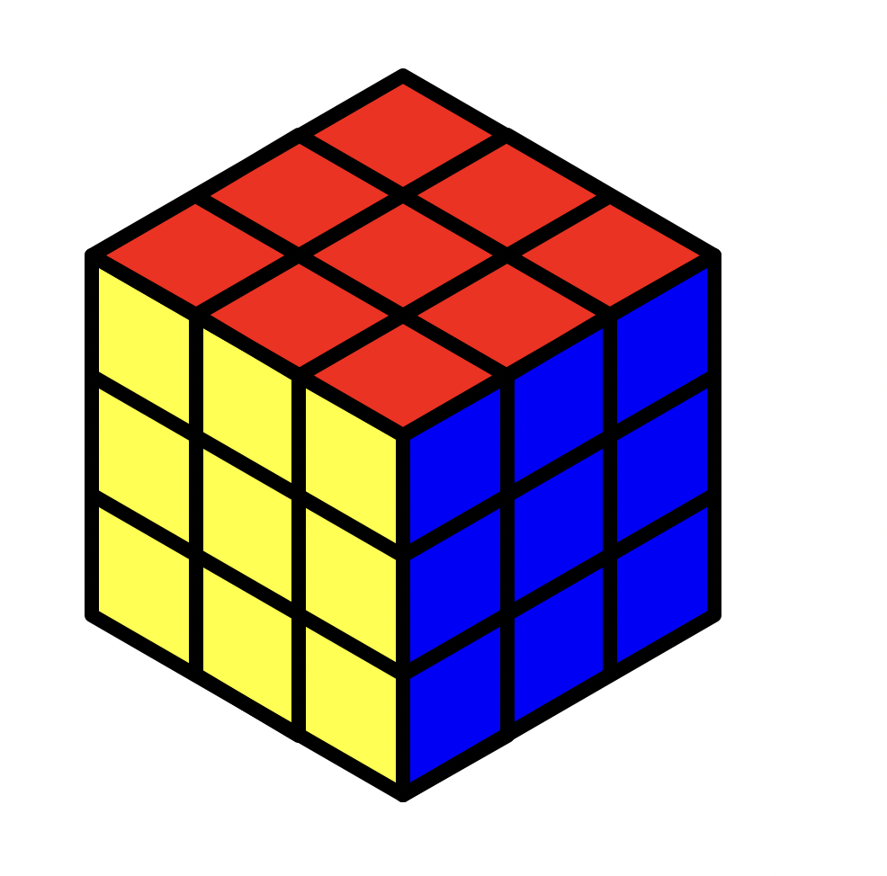

# CSS-225-Module-5
Solutions to CSS 225 Module 5 Assignments

## Problems:
1. Consider a program that prints “Hello World” to the screen 100 times. Use draw.io to draw the flow of execution. Then write the program. Submit both the flowchart and the code.

2. Assume you have a list of numbers 12, 10, 32, 3, 66, 17, 42, 99, 20.
Write a loop that prints each of the numbers on a new line.
Write a loop that prints each number and its square on a new line.

3. Write a program that asks the user for the number of sides, the length of the side, the color of the line, and the fill color of a regular polygon. The program should draw the polygon and then fill it in.

4. Consider a program that iterates the integers from 1 to 50. For multiples of three print “Divisible by three” instead of the number and for the multiples of five print “Divisible by five”. For numbers which are multiples of both three and five print “Divisible by both”. Use draw.io to draw the flow of execution. Then write the program. Submit both the flowchart and the code.

5. Write a program to draw some kind of picture. Be creative and experiment with the turtle methods provided in Summary of Turtle Methods. 

## Solutions
1. Solved using program in file "hello_100_times.py". Flowchart is in "Hello_100_times flowchart.pdf".
2. Solved using program in "list_loop.py".
3. Solved using program in "poly_draw.py".
4. Solved using program in "fizzbuzz.py". Flowchart is in "fizzbuzz flowchart.pdf".
5. Solved using program in "rubik_draw.py". Displays the following image: 
